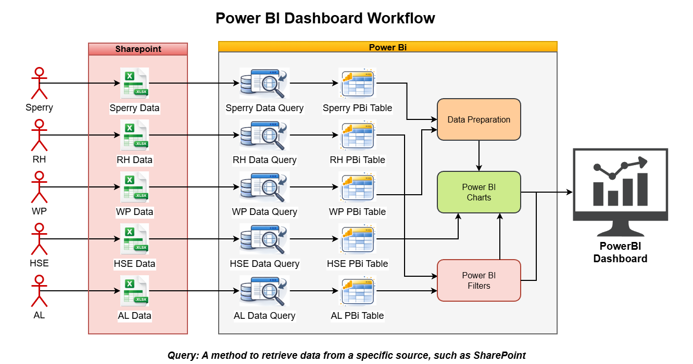

# Introduction - Understanding the behavior behind the data

Data has always been a valuable asset. However, recent advances in processing power have significantly increased the value that can be extracted from it, enabling not only the generation of insights but also the visualization of system behavior through key metrics.

In industries such as oil and gas, understanding how variables interact over time is critical. This has led to the development of tools that go beyond simple visualization, allowing engineers to interpret patterns, detect anomalies, and understand what the system is doing. Early examples of such tools include Cognos and Tableau, which require a certain level of expertise due to their complexity in connecting datasets and building visualizations.

Nowadays, Power BI facilitates the creation of these data representations, known as dashboards. One of its main advantages is its integration within the Microsoft ecosystem, which is widely used across many companies.

Thus, in today’s industrial environments, creating dashboards is no longer a competitive advantage but a fundamental skill—not just for success, but for effectively communicating the value generated by engineering work to stakeholders, especially in environments supported by tools such as Power BI, Excel, SharePoint, and Teams. While not perfect, these tools enable seamless connection to operational Excel files commonly used by engineers to record data.

Ultimately, dashboards are not just about being visually appealing, but about transforming operational data into meaningful insights that reflect the real value of the work performed.

# Objective

This project aims to facilitate the understanding of how to create a simple dashboard, focusing on how easily Excel files related to different PSLs within the oil and gas industry can be connected to build a unified view where all relevant information converges, allowing a quick understanding of day-to-day operations.

More importantly, this project serves as an introduction to Power BI, showing how data can be transformed into meaningful insights that capture the value of day-to-day engineering work through the use of key metrics.

# Solutions Architecture

The following figure presents the solution architecture for the implemented dashboard. Data is generated by personnel from different PSLs and stored in SharePoint, a widely used Microsoft tool for storing and sharing information within a company.

Power BI queries are then used to extract and prepare this data, making it available to generate insights and display key metrics through visualizations such as charts, helping communicate the impact of their work.

  
  <em>Figure 1. Power BI dashboard workflow architecture.</em>  

